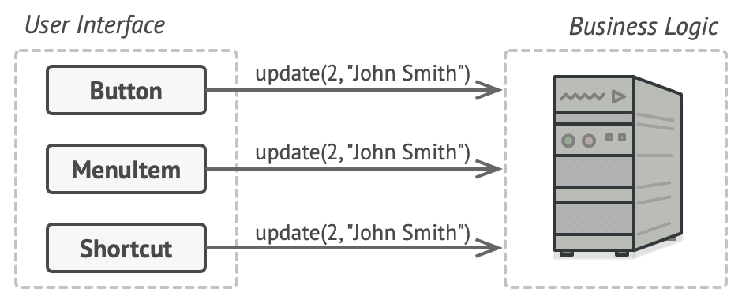
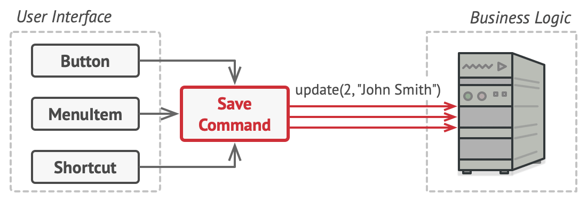

# Command

https://refactoring.guru/design-patterns/command 를 공부하며 정리한 내용입니다.

## Command란?

Command는 요청을 요청에 대한 모든 정보를 포함하는 독립 실행형 개체로 바꾸는 동작 디자인 패턴입니다. 이 변환을 통해 요청을 메서드 인수로 전달하고, 요청 실행을 지연 또는 대기열에 넣고, 실행 취소할 수 있는 작업을 지원할 수 있습니다.


## 문제

새로운 텍스트 편집기 앱에서 작업하고 있다고 상상해보십시오. 현재 작업은 편집기의 다양한 작업을 위한 여러 버튼이 있는 도구 모음을 만드는 것입니다. 도구 모음의 버튼과 다양한 대화 상자의 일반 버튼에 사용할 수 있는 매우 깔끔한 Button 클래스를 만들었습니다.


_<앱의 모든 버튼은 동일한 클래스에서 파생됩니다.>_

이 버튼은 모두 비슷해 보이지만 다른 기능을 수행해야 합니다. 이 버튼의 다양한 클릭 핸들러에 대한 코드를 어디에 두겠습니까? 가장 간단한 해결책은 버튼이 사용되는 각 위치에 대해 수많은 하위 클래스를 만드는 것입니다. 이러한 하위 클래스에는 버튼 클릭 시 실행되어야 하는 코드가 포함됩니다.


_<많은 버튼 하위 클래스. 무엇이 잘못될 수 있습니까?>_

머지 않아 이 접근 방식에 심각한 결함이 있음을 깨닫게 됩니다. 첫째, 엄청난 수의 하위 클래스가 있으며 기본 Button 클래스를 수정할 때마다 이러한 하위 클래스의 코드를 깨뜨릴 위험이 없다면 괜찮을 것입니다. 간단히 말해서 GUI 코드는 비즈니스 로직의 휘발성 코드에 어색하게 의존하게 되었습니다.


_<여러 클래스가 동일한 기능을 구현합니다.>_

그리고 가장 못생긴 부분이 있습니다. 텍스트 복사/붙여넣기와 같은 일부 작업은 여러 위치에서 호출해야 합니다. 예를 들어, 사용자는 도구 모음에서 작은 "복사" 버튼을 클릭하거나 컨텍스트 메뉴를 통해 무언가를 복사하거나 키보드에서 Ctrl+C를 누를 수 있습니다.

처음에는 앱에 도구 모음만 있었을 때 다양한 작업의 구현을 버튼 하위 클래스에 배치해도 괜찮았습니다. 즉, CopyButton 서브클래스 내부에 텍스트를 복사하는 코드가 있으면 괜찮습니다. 그러나 컨텍스트 메뉴, 바로 가기 및 기타 항목을 구현할 때 많은 클래스에서 작업 코드를 복제하거나 버튼에 종속된 메뉴를 만들어야 하며 이는 더 나쁜 옵션입니다.

## 해결책

좋은 소프트웨어 디자인은 일반적으로 앱을 여러 레이어로 나누는 결과를 가져오는 관심사 분리 원칙에 기반을 두고 있습니다. 가장 일반적인 예는 그래픽 사용자 인터페이스용 레이어와 비즈니스 로직용 레이어입니다. GUI 계층은 화면에 아름다운 그림을 렌더링하고 입력을 캡처하고 사용자와 앱이 수행하는 작업의 결과를 표시하는 역할을 합니다. 그러나 달의 궤적을 계산하거나 연례 보고서를 작성하는 것과 같은 중요한 작업을 수행할 때 GUI 계층은 비즈니스 논리의 기본 계층에 작업을 위임합니다.

코드에서 다음과 같이 보일 수 있습니다. GUI 개체는 비즈니스 논리 개체의 메서드를 호출하여 일부 인수를 전달합니다. 이 프로세스는 일반적으로 한 개체가 다른 요청을 보내는 것으로 설명됩니다.



_<GUI 개체는 비즈니스 논리 개체에 직접 액세스할 수 있습니다.>_

Command 패턴은 GUI 객체가 이러한 요청을 직접 보내서는 안 된다고 제안합니다. 대신 호출되는 개체, 메서드 이름 및 인수 목록과 같은 모든 요청 세부 정보를 이 요청을 트리거하는 단일 메서드가 있는 별도의 Command 클래스로 추출해야 합니다.

Command 개체는 다양한 GUI와 비즈니스 논리 개체 간의 링크 역할을 합니다. 이제부터 GUI 객체는 어떤 비즈니스 로직 객체가 요청을 받고 어떻게 처리할지 알 필요가 없습니다. GUI 개체는 모든 세부 사항을 처리하는 Command을 트리거합니다.



_<Command를 통해 비즈니스 논리 계층에 액세스합니다.>_

다음 단계는 Command가 동일한 인터페이스를 구현하도록 하는 것입니다. 일반적으로 매개 변수를 사용하지 않는 단일 실행 메서드만 있습니다. 이 인터페이스를 사용하면 구체적인 Command 클래스에 연결하지 않고도 동일한 요청 발신자와 함께 다양한 Command를 사용할 수 있습니다. 보너스로 이제 발신자에 연결된 Command 개체를 전환하여 런타임 시 발신자의 동작을 효과적으로 변경할 수 있습니다.

요청 매개변수인 퍼즐의 한 조각이 누락되었음을 알 수 있습니다. GUI 개체는 비즈니스 계층 개체에 일부 매개변수를 제공했을 수 있습니다. Command 실행 방법에는 매개변수가 없는데 어떻게 요청 내용을 수신자에게 전달할까요? Command는 이 데이터로 미리 구성되거나 자체적으로 가져올 수 있어야 합니다.


_<GUI 개체는 작업을 Command에 위임합니다.>_

텍스트 편집기로 돌아가봅시다. Command 패턴을 적용한 후에는 더 이상 다양한 클릭 동작을 구현하기 위해 모든 버튼 하위 클래스가 필요하지 않습니다. Command 개체에 대한 참조를 저장하는 기본 Button 클래스에 단일 필드를 넣고 클릭 시 버튼이 해당 Command를 실행하도록 하는 것으로 충분합니다.

가능한 모든 작업에 대해 많은 Command 클래스를 구현하고 버튼의 의도된 동작에 따라 특정 버튼과 연결합니다.

메뉴, 바로 가기 또는 전체 대화 상자와 같은 다른 GUI 요소도 같은 방식으로 구현할 수 있습니다. 사용자가 GUI 요소와 상호 작용할 때 실행되는 Command에 연결됩니다. 지금쯤 짐작하셨겠지만, 동일한 작업과 관련된 요소는 동일한 Command에 연결되어 코드 중복을 방지합니다.

결과적으로 Command는 GUI와 비즈니스 로직 계층 간의 결합을 줄이는 편리한 중간 계층이 됩니다. 그리고 이것은 Command 패턴이 제공할 수 있는 이점의 일부일 뿐입니다!

## 현실 유사성


_<레스토랑에서 주문하기.>_

도시를 한참 걷다 보면 멋진 레스토랑에 도착하여 창가 테이블에 앉습니다. 친절한 웨이터가 다가와 신속하게 주문을 받아 종이에 적습니다. 웨이터는 부엌으로 가서 주문서를 벽에 붙입니다. 잠시 후 셰프에게 주문이 전달되고 셰프는 이를 읽고 그에 따라 음식을 요리합니다. 요리사는 주문과 함께 쟁반에 식사를 놓습니다. 웨이터는 트레이를 발견하고 모든 것이 원하는 대로 주문되었는지 확인하고 모든 것을 테이블로 가져옵니다.

종이 주문은 Command 역할을 합니다. 요리사가 서빙할 준비가 될 때까지 대기열에 남아 있습니다. 주문에는 식사를 요리하는 데 필요한 모든 관련 정보가 포함되어 있습니다. 이를 통해 요리사는 주문 세부 사항을 직접 설명하는 대신 바로 요리를 시작할 수 있습니다.

## 구조


1. Sender (Invoker라고도 함): 요청 시작을 담당합니다 . 이 클래스에는 Command 개체에 대한 참조를 저장하기 위한 필드가 있어야 합니다. 발신자는 요청을 수신자에게 직접 보내는 대신 해당 Command를 트리거합니다. 발신자는 Command 개체를 생성할 책임이 없습니다. 일반적으로 생성자를 통해 클라이언트에서 미리 생성된 Command를 받습니다.
2. Command 인터페이스: 일반적으로 Command를 실행하기 위한 단일 메서드만 선언합니다.
3. Concrete Command: 다양한 종류의 요청을 구현합니다. Concrete Command는 자체적으로 작업을 수행하는 것이 아니라 비즈니스 논리 개체 중 하나로 호출을 전달해야 합니다. 그러나 코드를 단순화하기 위해 이러한 클래스를 병합할 수 있습니다. 수신 개체에서 메서드를 실행하는 데 필요한 매개 변수는 Concrete Command 필드로 선언할 수 있습니다. 생성자를 통해서만 이러한 필드의 초기화를 허용하여 Command 개체를 변경할 수 없도록 만들 수 있습니다.
4. Receiver: 몇 가지 비즈니스 로직이 포함되어 있습니다. 거의 모든 개체가 수신기 역할을 할 수 있습니다. 대부분의 Command는 요청이 Receiver에게 전달되는 방법에 대한 세부 정보만 처리하는 반면 Receiver 자체는 실제 작업을 수행합니다.
5. 클라이언트: Concrete Command 개체를 만들고 구성합니다. 클라이언트는 Receiver 인스턴스를 포함한 모든 요청 매개변수를 명령의 생성자에 전달해야 합니다. 그 후 결과 Command는 하나 또는 여러 Sender와 연관될 수 있습니다.

## 의사 코드

이 예에서 Command 패턴은 실행된 작업의 기록을 추적하는 데 도움이 되며 필요한 경우 작업을 되돌릴 수 있습니다.


_<텍스트 편집기에서 실행 취소할 수 있는 작업입니다.>_

편집기 상태를 변경하는 Command(예: 잘라내기 및 붙여넣기)은 Command와 관련된 작업을 실행하기 전에 편집기 상태의 백업 복사본을 만듭니다. Command가 실행된 후 해당 시점의 편집기 상태 백업 복사본과 함께 Command 기록(Command 개체 스택)에 배치됩니다. 나중에 사용자가 작업을 되돌려야 하는 경우 앱은 기록에서 가장 최근 Command를 가져와 편집기 상태의 관련 백업을 읽고 복원할 수 있습니다.

클라이언트 코드(GUI 요소, Command 기록 등)는 Command 인터페이스를 통해 Command와 함께 작동하기 때문에 Concrete Command 클래스에 연결되지 않습니다. 이 접근 방식을 사용하면 기존 코드를 손상시키지 않고 앱에 새 Command를 도입할 수 있습니다.

```java
// 기본 Command 클래스는 모든 Concrete Command에 대한 공통 인터페이스를 정의합니다.
abstract class Command is
    protected field app: Application
    protected field editor: Editor
    protected field backup: text

    constructor Command(app: Application, editor: Editor) is
        this.app = app
        this.editor = editor

    // 편집기의 상태를 백업하십시오.
    method saveBackup() is
        backup = editor.text

    // 편집기의 상태를 복원합니다.
    method undo() is
        editor.text = backup

    // 실행 방법은 모든 Concrete Command가 자체 구현을 제공하도록 강제로 추상으로 선언됩니다. 이 메서드는 Command가 편집기의 상태를 변경하는지 여부에 따라 true 또는 false를 반환해야 합니다.
    abstract method execute()


// Concrete Command는 여기에 있습니다.
class CopyCommand extends Command is
    // 복사 명령은 편집기의 상태를 변경하지 않기 때문에 기록에 저장되지 않습니다.
    method execute() is
        app.clipboard = editor.getSelection()
        return false

class CutCommand extends Command is
    // cut 명령은 편집기의 상태를 변경하므로 기록에 저장해야 합니다. 그리고 메서드가 true를 반환하는 한 저장됩니다.
    method execute() is
        saveBackup()
        app.clipboard = editor.getSelection()
        editor.deleteSelection()
        return true

class PasteCommand extends Command is
    method execute() is
        saveBackup()
        editor.replaceSelection(app.clipboard)
        return true

// 실행 취소 작업도 Command입니다.
class UndoCommand extends Command is
    method execute() is
        app.undo()
        return false


// 전역 Command 기록은 스택일 뿐입니다.
class CommandHistory is
    private field history: array of Command

    // Last in...
    method push(c: Command) is
        // Command를 기록 배열의 끝으로 푸시합니다.

    // ...first out
    method pop():Command is
        // 기록에서 가장 최근의 Command를 가져옵니다.

// 편집기 클래스에는 실제 텍스트 편집 작업이 있습니다. Receiver의 역할을 합니다. 모든 Command는 결국 편집기의 메서드에 실행을 위임합니다.
class Editor is
    field text: string

    method getSelection() is
        // 선택한 텍스트를 반환합니다.

    method deleteSelection() is
        // 선택한 텍스트를 삭제합니다.

    method replaceSelection(text) is
        // 현재 위치에 클립보드의 내용 삽입

// 응용 프로그램 클래스는 개체 관계를 설정합니다. Sender 역할을 합니다. 수행해야 할 작업이 있을 때 Command 개체를 만들고 실행합니다.
class Application is
    field clipboard: string
    field editors: array of Editors
    field activeEditor: Editor
    field history: CommandHistory

    // UI 개체에 Command를 할당하는 코드는 다음과 같습니다.
    method createUI() is
        // ...
        copy = function() {
            executeCommand(new CopyCommand(this, activeEditor))
        }

        copyButton.setCommand(copy)
        shortcuts.onKeyPress("Ctrl+C", copy)

        cut = function() {
            executeCommand(new CutCommand(this, activeEditor))
        }

        cutButton.setCommand(cut)
        shortcuts.onKeyPress("Ctrl+X", cut)

        paste = function() {
            executeCommand(new PasteCommand(this, activeEditor))
        }

        pasteButton.setCommand(paste)
        shortcuts.onKeyPress("Ctrl+V", paste)

        undo = function() {
            executeCommand(new UndoCommand(this, activeEditor))
        }

        undoButton.setCommand(undo)
        shortcuts.onKeyPress("Ctrl+Z", undo)

    // Command를 실행하여 히스토리에 추가해야 하는지 확인합니다.
    method executeCommand(command) is
        if (command.execute)
            history.push(command)

    // 기록에서 가장 최근 Command를 가져와 실행 취소 방법을 실행합니다. 해당 Command의 클래스를 알지 못합니다. 그러나 Command가 자체 작업을 취소하는 방법을 알고 있기 때문에 그렇게 할 필요가 없습니다.
    method undo() is
        command = history.pop()
        if (command != null)
            command.undo()
```

## 적용 가능성

**작업으로 개체를 매개변수화하려는 경우 Command 패턴을 사용합니다.**

Command 패턴은 특정 메서드 호출을 독립 실행형 개체로 전환할 수 있습니다. 이 변경으로 많은 흥미로운 용도가 열립니다. Command를 메서드 인수로 전달하고, 다른 개체 내부에 저장하고, 런타임에 연결된 Command를 전환하는 등의 작업이 가능합니다.

예를 들면 다음과 같습니다. 컨텍스트 메뉴와 같은 GUI 구성 요소를 개발 중이고 최종 사용자가 항목을 클릭할 때 작업을 트리거하는 메뉴 항목을 사용자가 구성할 수 있기를 원합니다.

**작업을 대기열에 넣거나 실행을 예약하거나 원격으로 실행하려는 경우 Command 패턴을 사용합니다.**

다른 개체와 마찬가지로 Command를 직렬화할 수 있습니다. 즉, 파일이나 데이터베이스에 쉽게 쓸 수 있는 문자열로 변환할 수 있습니다. 나중에 문자열을 초기 Command 개체로 복원할 수 있습니다. 따라서 Command 실행을 지연하고 예약할 수 있습니다. 하지만 더 많은 것이 있습니다! 같은 방식으로 네트워크를 통해 Command를 대기열에 추가하거나 기록하거나 보낼 수 있습니다.

**되돌릴 수 있는 작업을 구현하려는 경우 Command 패턴을 사용합니다.**

실행 취소/다시 실행을 구현하는 방법에는 여러 가지가 있지만 Command 패턴이 아마도 가장 많이 사용되는 패턴일 것입니다.

작업을 되돌릴 수 있으려면 수행된 작업의 기록을 구현해야 합니다. Command History는 응용 프로그램 상태의 관련 백업과 함께 실행된 모든 Command 개체를 포함하는 스택입니다.

이 방법에는 두 가지 단점이 있습니다. 첫째, 애플리케이션의 일부가 비공개일 수 있기 때문에 애플리케이션의 상태를 저장하는 것이 쉽지 않습니다. 이 문제는 Memento 패턴으로 완화할 수 있습니다.

둘째, 상태 백업은 상당히 많은 RAM을 소모할 수 있습니다. 따라서 때로는 대체 구현에 의존할 수 있습니다. 과거 상태를 복원하는 대신 명령이 반대 작업을 수행합니다. 반대 작업에도 대가가 있습니다. 구현하기 어렵거나 심지어 불가능할 수도 있습니다.

## 구현방법

1. 단일 실행 메소드로 Command 인터페이스를 선언하십시오.
2. Command 인터페이스를 구현하는 Concrete Command 클래스로 요청 추출을 시작합니다. 각 클래스에는 실제 Receiver 객체에 대한 참조와 함께 요청 인수를 저장하기 위한 필드 세트가 있어야 합니다. 이 모든 값은 Command의 생성자를 통해 초기화되어야 합니다.
3. Sender 역할을 할 클래스를 식별합니다. 이러한 클래스에 Command를 저장하기 위한 필드를 추가합니다. Sender는 Command 인터페이스를 통해서만 Command와 통신해야 합니다. Sender는 일반적으로 Command 개체를 자체적으로 생성하지 않고 클라이언트 코드에서 가져옵니다.
4. Receiver에게 직접 요청을 보내는 대신 Command를 실행하도록 Sender를 변경합니다.
5. 클라이언트는 다음 순서로 개체를 초기화해야 합니다.
   - Receiver를 만듭니다.
   - Command를 만들고 필요한 경우 Receiver와 연결합니다.
   - Sender를 만들고 특정 Command와 연결합니다.

## 장단점

### 장점

- 단일 책임 원칙. 이러한 작업을 수행하는 클래스에서 작업을 호출하는 클래스를 분리할 수 있습니다.
- 개방/폐쇄 원칙. 기존 클라이언트 코드를 손상시키지 않고 앱에 새 Command를 도입할 수 있습니다.
- 실행 취소/다시 실행을 구현할 수 있습니다.
- 지연된 작업 실행을 구현할 수 있습니다.
- 간단한 명령 세트를 복잡한 명령으로 조합할 수 있습니다.

### 단점

Sender와 Receiver 사이에 완전히 새로운 계층을 도입하기 때문에 코드가 더 복잡해질 수 있습니다.

### 자바스크립트 예제

```javascript
function add(x, y) {
  return x + y;
}
function sub(x, y) {
  return x - y;
}
function mul(x, y) {
  return x * y;
}
function div(x, y) {
  return x / y;
}

var Command = function (execute, undo, value) {
  this.execute = execute;
  this.undo = undo;
  this.value = value;
};

var AddCommand = function (value) {
  return new Command(add, sub, value);
};

var SubCommand = function (value) {
  return new Command(sub, add, value);
};

var MulCommand = function (value) {
  return new Command(mul, div, value);
};

var DivCommand = function (value) {
  return new Command(div, mul, value);
};

var Calculator = function () {
  var current = 0;
  var commands = [];

  function action(command) {
    var name = command.execute.toString().substr(9, 3);
    return name.charAt(0).toUpperCase() + name.slice(1);
  }

  return {
    execute: function (command) {
      current = command.execute(current, command.value);
      commands.push(command);
      console.log(action(command) + ": " + command.value);
    },

    undo: function () {
      var command = commands.pop();
      current = command.undo(current, command.value);
      console.log("Undo " + action(command) + ": " + command.value);
    },

    getCurrentValue: function () {
      return current;
    },
  };
};

function run() {
  var calculator = new Calculator();

  // issue commands

  calculator.execute(new AddCommand(100));
  calculator.execute(new SubCommand(24));
  calculator.execute(new MulCommand(6));
  calculator.execute(new DivCommand(2));

  // reverse last two commands

  calculator.undo();
  calculator.undo();

  console.log("\nValue: " + calculator.getCurrentValue());
}
```
