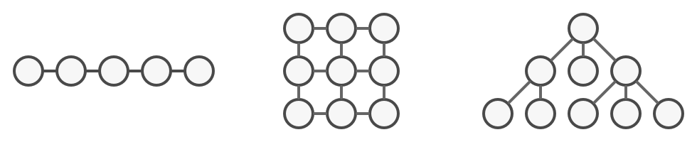
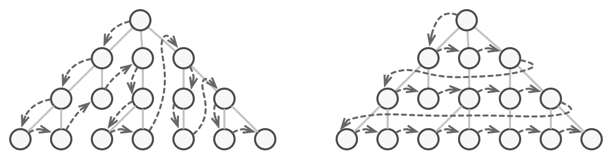

# Iterator

https://refactoring.guru/design-patterns/iterator 를 공부하며 정리한 내용입니다.

## Iterator란?

Iterator는 기본 표현(목록, 스택, 트리 등)을 노출하지 않고 컬렉션의 요소를 순회할 수 있도록 하는 동작 디자인 패턴입니다.


## 문제

컬렉션은 프로그래밍에서 가장 많이 사용되는 데이터 유형 중 하나입니다. 그럼에도 불구하고 컬렉션은 개체 그룹에 대한 컨테이너일 뿐입니다.



_<다양한 유형의 컬렉션.>_

대부분의 컬렉션은 요소를 간단한 목록에 저장합니다. 그러나 그 중 일부는 스택, 트리, 그래프 및 기타 복잡한 데이터 구조를 기반으로 합니다.

그러나 컬렉션이 어떻게 구성되어 있든 다른 코드에서 이러한 요소를 사용할 수 있도록 컬렉션은 해당 요소에 액세스할 수 있는 방법을 제공해야 합니다. 동일한 요소에 계속해서 액세스하지 않고 컬렉션의 각 요소를 통과하는 방법이 있어야 합니다.

목록을 기반으로 하는 컬렉션이 있는 경우 이는 쉬운 작업처럼 들릴 수 있습니다. 모든 요소를 ​​반복하면 됩니다. 그러나 트리와 같은 복잡한 데이터 구조의 요소를 어떻게 순차적으로 탐색합니까? 예를 들어, 어느 날 트리의 깊이 우선 탐색으로 괜찮을 수 있습니다. 그러나 다음 날에는 너비 우선 탐색이 필요할 수 있습니다. 그리고 다음 주에는 트리 요소에 대한 임의 액세스와 같은 다른 것이 필요할 수 있습니다.



_<동일한 컬렉션을 여러 가지 방법으로 순회할 수 있습니다.>_

컬렉션에 더 많은 순회 알고리즘을 추가하면 효율적인 데이터 저장이라는 기본 책임이 점차 흐려집니다. 또한 일부 알고리즘은 특정 응용 프로그램에 맞게 조정될 수 있으므로 일반 컬렉션 클래스에 포함하는 것이 이상할 수 있습니다.

반면에 다양한 컬렉션과 함께 작동해야 하는 클라이언트 코드는 요소를 저장하는 방법에 신경조차 쓰지 않을 수 있습니다. 그러나 컬렉션은 모두 해당 요소에 액세스하는 다른 방법을 제공하므로 코드를 특정 컬렉션 클래스에 연결하는 것 외에는 다른 옵션이 없습니다.

## 해결책

Iterator 패턴의 주요 아이디어는 컬렉션의 순회 동작을 iterator라는 별도의 객체로 추출하는 것입니다.


_<반복자는 다양한 순회 알고리즘을 구현합니다. 여러 반복자 객체가 동시에 같은 컬렉션을 순회할 수 있습니다.>_

알고리즘 자체를 구현하는 것 외에도 iterator 객체는 현재 위치 및 끝까지 남은 요소 수와 같은 모든 탐색 세부 정보를 캡슐화합니다. 이 때문에 여러 반복자가 서로 독립적으로 동시에 동일한 컬렉션을 통과할 수 있습니다.

일반적으로 반복자는 컬렉션의 요소를 가져오기 위한 하나의 기본 방법을 제공합니다. 클라이언트는 아무 것도 반환하지 않을 때까지 이 메서드를 계속 실행할 수 있습니다. 이는 반복자가 모든 요소를 ​​순회했음을 의미합니다.

모든 반복자는 동일한 인터페이스를 구현해야 합니다. 이렇게 하면 적절한 반복자가 있는 한 클라이언트 코드가 모든 컬렉션 유형 또는 순회 알고리즘과 호환됩니다. 컬렉션을 순회하는 특별한 방법이 필요한 경우 컬렉션이나 클라이언트를 변경할 필요 없이 새 반복자 클래스를 만들기만 하면 됩니다.

## 구조


1. Iterator 인터페이스: 컬렉션 순회에 필요한 작업(다음 요소 가져오기, 현재 위치 검색, 반복 다시 시작 등)을 선언합니다.
2. Concrete Iterator: 컬렉션 순회를 위한 특정 알고리즘을 구현합니다. iterator 객체는 자체적으로 순회 진행을 추적해야 합니다. 이를 통해 여러 반복자가 서로 독립적으로 동일한 컬렉션을 순회할 수 있습니다.
3. Collection 인터페이스: 컬렉션과 호환되는 반복자를 얻기 위한 하나 이상의 메서드를 선언합니다. 구체적인 컬렉션이 다양한 종류의 반복자를 반환할 수 있도록 메서드의 반환 유형을 반복자 인터페이스로 선언해야 합니다.
4. Concrete Collection: 클라이언트가 요청할 때마다 특정 구체 반복기 클래스의 새 인스턴스를 반환합니다. 컬렉션의 나머지 코드는 어디에 있습니까? 걱정하지 마십시오. 같은 클래스에 있어야 합니다. 이러한 세부 사항은 실제 패턴에 중요하지 않으므로 생략합니다.
5. Client: 인터페이스를 통해 컬렉션 및 반복자와 함께 작동합니다. 이렇게 하면 클라이언트가 구체적인 클래스에 연결되지 않으므로 동일한 클라이언트 코드로 다양한 컬렉션과 반복자를 사용할 수 있습니다. 일반적으로 클라이언트는 자체적으로 반복자를 생성하지 않고 대신 컬렉션에서 가져옵니다. 그러나 어떤 경우에는 클라이언트가 직접 만들 수 있습니다. 예를 들어 클라이언트가 고유한 특수 반복자를 정의할 때입니다.

## 의사 코드

이 예에서 Iterator 패턴은 Facebook의 소셜 그래프에 대한 액세스를 캡슐화하는 특별한 종류의 컬렉션을 탐색하는 데 사용됩니다. 컬렉션은 다양한 방식으로 프로필을 순회할 수 있는 여러 반복자를 제공합니다.


_<소셜 프로필을 반복하는 예.>_

'friends' 반복자는 특정 프로필의 친구를 탐색하는 데 사용할 수 있습니다. 'colleagues' 반복자는 대상 사람과 같은 회사에서 일하지 않는 친구를 제외한다는 점을 제외하고는 동일한 작업을 수행합니다. 두 반복자는 인증 및 REST 요청 전송과 같은 구현 세부 사항을 자세히 살펴보지 않고도 클라이언트가 프로필을 가져올 수 있도록 하는 공통 인터페이스를 구현합니다.

클라이언트 코드는 인터페이스를 통해서만 컬렉션 및 반복자와 함께 작동하기 때문에 구체적인 클래스에 연결되지 않습니다. 앱을 새 소셜 네트워크에 연결하기로 결정했다면 기존 코드를 변경하지 않고 새 컬렉션 및 반복자 클래스를 제공하기만 하면 됩니다.

```java
// 컬렉션 인터페이스는 반복자를 생성하기 위한 팩토리 메서드를 선언해야 합니다. 프로그램에서 사용할 수 있는 여러 종류의 반복이 있는 경우 여러 메서드를 선언할 수 있습니다.
interface SocialNetwork is
    method createFriendsIterator(profileId):ProfileIterator
    method createCoworkersIterator(profileId):ProfileIterator


// 각 구체적인 컬렉션은 반환하는 구체적인 반복기 클래스 집합에 연결됩니다. 그러나 클라이언트는 그렇지 않습니다. 이러한 메서드의 서명은 반복자 인터페이스를 반환하기 때문입니다.
class Facebook implements SocialNetwork is
    // ... 컬렉션 코드의 대부분은 여기에 있어야 합니다. ...

    // 반복자 생성 코드.
    method createFriendsIterator(profileId) is
        return new FacebookIterator(this, profileId, "friends")
    method createCoworkersIterator(profileId) is
        return new FacebookIterator(this, profileId, "coworkers")


// 모든 반복자를 위한 공통 인터페이스.
interface ProfileIterator is
    method getNext():Profile
    method hasMore():bool


// Concrete Iterator 클래스.
class FacebookIterator implements ProfileIterator is
    // iterator는 순회하는 컬렉션에 대한 참조가 필요합니다.
    private field facebook: Facebook
    private field profileId, type: string

    // iterator 객체는 다른 iterator와 독립적으로 컬렉션을 순회합니다. 따라서 반복 상태를 저장해야 합니다.
    private field currentPosition
    private field cache: array of Profile

    constructor FacebookIterator(facebook, profileId, type) is
        this.facebook = facebook
        this.profileId = profileId
        this.type = type

    private method lazyInit() is
        if (cache == null)
            cache = facebook.socialGraphRequest(profileId, type)

    // 각 Concrete Iterator 클래스에는 공통 iterator 인터페이스의 자체 구현이 있습니다.
    method getNext() is
        if (hasMore())
            currentPosition++
            return cache[currentPosition]

    method hasMore() is
        lazyInit()
        return currentPosition < cache.length


// 여기에 또 다른 유용한 트릭이 있습니다. 전체 컬렉션에 대한 액세스를 제공하는 대신 클라이언트 클래스에 반복자를 전달할 수 있습니다. 이렇게 하면 컬렉션을 클라이언트에 노출하지 않습니다.
// 그리고 또 다른 이점이 있습니다. 클라이언트가 다른 반복자를 전달하여 런타임에 컬렉션을 사용하는 방식을 변경할 수 있습니다. 이것은 클라이언트 코드가 Concrete Iterator 클래스에 연결되어 있지 않기 때문에 가능합니다.
class SocialSpammer is
    method send(iterator: ProfileIterator, message: string) is
        while (iterator.hasMore())
            profile = iterator.getNext()
            System.sendEmail(profile.getEmail(), message)


// 애플리케이션 클래스는 컬렉션과 반복자를 구성한 다음 클라이언트 코드에 전달합니다.
class Application is
    field network: SocialNetwork
    field spammer: SocialSpammer

    method config() is
        if working with Facebook
            this.network = new Facebook()
        if working with LinkedIn
            this.network = new LinkedIn()
        this.spammer = new SocialSpammer()

    method sendSpamToFriends(profile) is
        iterator = network.createFriendsIterator(profile.getId())
        spammer.send(iterator, "Very important message")

    method sendSpamToCoworkers(profile) is
        iterator = network.createCoworkersIterator(profile.getId())
        spammer.send(iterator, "Very important message")
```

## 적용 가능성

**컬렉션의 내부에 복잡한 데이터 구조가 있지만 그 복잡성을 클라이언트로부터 숨기고 싶은 경우(편의 또는 보안상의 이유로) Iterator 패턴을 사용하십시오.**

반복자는 복잡한 데이터 구조 작업의 세부 사항을 캡슐화하여 클라이언트에 컬렉션 요소에 액세스하는 몇 가지 간단한 방법을 제공합니다. 이 접근 방식은 클라이언트에게 매우 편리하지만 컬렉션을 직접 사용하는 경우 클라이언트가 수행할 수 있는 부주의하거나 악의적인 작업으로부터 컬렉션을 보호합니다.

**패턴을 사용하여 앱 전체에서 순회 코드의 중복을 줄이십시오.**

중요하지 않은 반복 알고리즘의 코드는 매우 부피가 큰 경향이 있습니다. 앱의 비즈니스 로직 내에 배치되면 원본 코드의 책임이 흐려지고 유지 관리가 어려워질 수 있습니다. 순회 코드를 지정된 반복기로 이동하면 애플리케이션 코드를 보다 간결하고 깔끔하게 만들 수 있습니다.

**코드가 다른 데이터 구조를 순회할 수 있기를 원하거나 이러한 구조의 유형을 미리 알 수 없는 경우 Iterator를 사용하십시오.**

패턴은 컬렉션과 반복자 모두에 대한 몇 가지 일반 인터페이스를 제공합니다. 코드가 이제 이러한 인터페이스를 사용한다는 점을 감안할 때 이러한 인터페이스를 구현하는 다양한 종류의 컬렉션 및 반복자를 전달하면 여전히 작동합니다.

## 구현방법

1. 반복자 인터페이스를 선언합니다. 최소한 컬렉션에서 다음 요소를 가져오는 메서드가 있어야 합니다. 그러나 편의를 위해 이전 요소 가져오기, 현재 위치 추적, 반복 종료 확인과 같은 몇 가지 다른 방법을 추가할 수 있습니다.
2. 컬렉션 인터페이스를 선언하고 반복자를 가져오는 방법을 설명합니다. 반환 유형은 반복자 인터페이스의 유형과 같아야 합니다. 별개의 반복자 그룹을 여러 개 만들려는 경우 유사한 메서드를 선언할 수 있습니다.
3. 반복기로 순회할 수 있는 컬렉션에 대한 구체적인 반복기 클래스를 구현합니다. 반복자 개체는 단일 컬렉션 인스턴스와 연결되어야 합니다. 일반적으로 이 링크는 반복자의 생성자를 통해 설정됩니다.
4. 컬렉션 클래스에서 컬렉션 인터페이스를 구현합니다. 주요 아이디어는 특정 컬렉션 클래스에 맞게 조정된 반복자를 생성하기 위한 바로 가기를 클라이언트에 제공하는 것입니다. 컬렉션 객체는 반복자의 생성자에 자신을 전달하여 이들 사이에 링크를 설정해야 합니다.
5. 클라이언트 코드를 살펴보고 모든 컬렉션 순회 코드를 반복자를 사용하여 교체합니다. 클라이언트는 컬렉션 요소를 반복해야 할 때마다 새 반복기 개체를 가져옵니다.

## 장단점

### 장점

- 단일 책임 원칙. 부피가 큰 순회 알고리즘을 별도의 클래스로 추출하여 클라이언트 코드와 컬렉션을 정리할 수 있습니다.
- 개방/폐쇄 원칙. 새로운 유형의 컬렉션 및 반복자를 구현하고 아무 것도 손상시키지 않고 기존 코드에 전달할 수 있습니다.
- 각 반복기 개체에는 고유한 반복 상태가 포함되어 있으므로 동일한 컬렉션을 병렬로 반복할 수 있습니다.
- 같은 이유로 반복을 지연하고 필요할 때 계속할 수 있습니다.

### 단점

- 앱이 간단한 컬렉션에서만 작동하는 경우 패턴을 적용하는 것은 과도할 수 있습니다.
- 반복자를 사용하는 것은 일부 특수 컬렉션의 요소를 직접 살펴보는 것보다 덜 효율적일 수 있습니다.

### 자바스크립트 예제

```javascript
var Iterator = function (items) {
  this.index = 0;
  this.items = items;
};

Iterator.prototype = {
  first: function () {
    this.reset();
    return this.next();
  },
  next: function () {
    return this.items[this.index++];
  },
  hasNext: function () {
    return this.index <= this.items.length;
  },
  reset: function () {
    this.index = 0;
  },
  each: function (callback) {
    for (var item = this.first(); this.hasNext(); item = this.next()) {
      callback(item);
    }
  },
};

function run() {
  var items = ["one", 2, "circle", true, "Applepie"];
  var iter = new Iterator(items);

  // using for loop

  for (var item = iter.first(); iter.hasNext(); item = iter.next()) {
    console.log(item);
  }
  console.log("");

  // using Iterator's each method

  iter.each(function (item) {
    console.log(item);
  });
}
```
