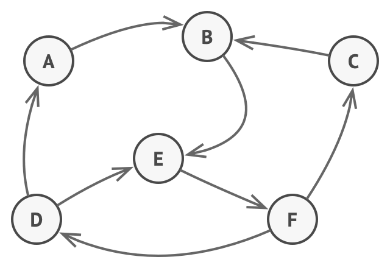
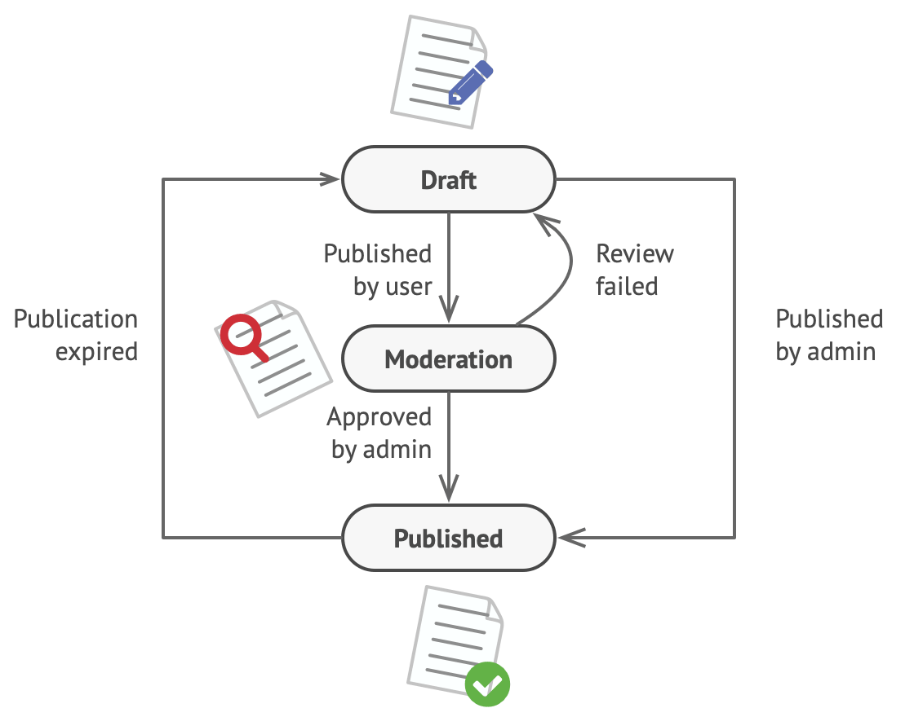

# State

https://refactoring.guru/design-patterns/state 를 공부하며 정리한 내용입니다.

## State란?

State는 내부 상태가 변경될 때 객체가 동작을 변경할 수 있도록 하는 동작 디자인 패턴입니다. 객체가 클래스를 변경한 것처럼 보입니다.


## 문제

State 패턴은 유한 상태 기계의 개념과 밀접하게 관련되어 있습니다.



_<유한 상태 기계.>_

주요 아이디어는 주어진 순간에 프로그램이 있을 수 있는 제한된 수의 상태가 있다는 것입니다. 고유한 상태 내에서 프로그램은 다르게 동작하고 프로그램은 한 상태에서 다른 상태로 즉시 전환될 수 있습니다. 그러나 현재 상태에 따라 프로그램이 특정 다른 상태로 전환되거나 전환되지 않을 수 있습니다. 전환이라고 하는 이러한 전환 규칙도 유한하고 미리 결정되어 있습니다.

이 접근 방식을 개체에 적용할 수도 있습니다. Document 클래스가 있다고 상상해보십시오. 문서는 Draft, Moderation 및 Published의 세 가지 상태 중 하나일 수 있습니다. 문서의 게시 방법은 각 상태에서 약간 다르게 작동합니다.

- Draft: 문서를 중재로 이동합니다.
- Moderation: 현재 사용자가 관리자인 경우에만 문서를 공개합니다.
- Published: 아무 것도 하지 않습니다.



_<문서 개체의 가능한 상태 및 전환.>_

상태 머신은 일반적으로 개체의 현재 상태에 따라 적절한 동작을 선택하는 많은 조건문(if 또는 switch)으로 구현됩니다. 일반적으로 이 "상태"는 개체 필드의 값 집합일 뿐입니다. 이전에 유한 상태 기계에 대해 들어 본 적이 없더라도 적어도 한 번 상태를 구현했을 것입니다. 다음 코드 구조에서 벨이 울리나요?

```java
class Document is
    field state: string
    // ...
    method publish() is
        switch (state)
            "draft":
                state = "moderation"
                break
            "moderation":
                if (currentUser.role == 'admin')
                    state = "published"
                break
            "published":
                // Do nothing.
                break
    // ...
```

조건을 기반으로 하는 상태 머신의 가장 큰 약점은 Document 클래스에 상태와 상태 종속 동작을 점점 더 추가하기 시작하면 드러납니다. 대부분의 메서드에는 현재 상태에 따라 메서드의 적절한 동작을 선택하는 엄청난 조건이 포함됩니다. 전환 논리를 변경하려면 모든 메서드에서 상태 조건을 변경해야 할 수 있기 때문에 이와 같은 코드를 유지 관리하기가 매우 어렵습니다.

문제는 프로젝트가 발전함에 따라 더 커지는 경향이 있습니다. 설계 단계에서 가능한 모든 상태와 전환을 예측하는 것은 매우 어렵습니다. 따라서 제한된 조건부 세트로 구축된 린 상태 머신은 시간이 지남에 따라 부풀려진 엉망으로 성장할 수 있습니다.

## 해결책

State 패턴은 개체의 모든 가능한 상태에 대해 새 클래스를 만들고 모든 상태별 동작을 이러한 클래스로 추출할 것을 제안합니다.

모든 동작을 자체적으로 구현하는 대신 컨텍스트라고 하는 원래 개체는 현재 상태를 나타내는 상태 개체 중 하나에 대한 참조를 저장하고 모든 상태 관련 작업을 해당 개체에 위임합니다.


_<Document는 작업을 상태 개체에 위임합니다.>_

컨텍스트를 다른 상태로 전환하려면 활성 상태 개체를 새 상태를 나타내는 다른 개체로 바꿉니다. 이것은 모든 상태 클래스가 동일한 인터페이스를 따르고 컨텍스트 자체가 해당 인터페이스를 통해 이러한 객체와 작동하는 경우에만 가능합니다.

이 구조는 전략 패턴과 유사해 보이지만 한 가지 중요한 차이점이 있습니다. 상태 패턴에서 특정 상태는 서로를 인식하고 한 상태에서 다른 상태로의 전환을 시작할 수 있지만 전략은 서로에 대해 거의 알지 못합니다.

## 현실 유사성

스마트폰의 버튼과 스위치는 장치의 현재 상태에 따라 다르게 작동합니다.

- 전화기가 잠금 해제된 상태에서 버튼을 누르면 다양한 기능이 실행됩니다.
- 전화기가 잠겨 있을 때 아무 버튼이나 누르면 잠금 해제 화면으로 이동합니다.
- 휴대폰의 충전량이 적을 때 아무 버튼이나 누르면 충전 화면이 나타납니다.

## 구조


1. Context: 구체적인 상태 개체 중 하나에 대한 참조를 저장하고 모든 상태별 작업을 여기에 위임합니다. 컨텍스트는 상태 인터페이스를 통해 상태 객체와 통신합니다. 컨텍스트는 새 상태 개체를 전달하기 위한 setter를 노출합니다.
2. State 인터페이스: 상태별 메소드를 선언합니다. 이러한 메서드는 모든 구체적인 상태에 대해 의미가 있어야 합니다. 일부 상태에서 호출되지 않을 쓸모 없는 메서드가 있는 것을 원하지 않기 때문입니다.
3. Concrete State: 상태별 메서드에 대한 자체 구현을 제공합니다. 여러 상태에서 유사한 코드의 중복을 피하기 위해 일부 공통 동작을 캡슐화하는 중간 추상 클래스를 제공할 수 있습니다. 상태 개체는 컨텍스트 개체에 대한 역참조를 저장할 수 있습니다. 이 참조를 통해 상태는 컨텍스트 개체에서 필요한 정보를 가져올 수 있을 뿐만 아니라 상태 전환을 시작할 수 있습니다.
4. Context와 Concreate State 모두 컨텍스트의 다음 상태를 설정하고 컨텍스트에 연결된 상태 개체를 교체하여 실제 상태 전환을 수행할 수 있습니다.

## 의사 코드

이 예에서 상태 패턴을 사용하면 미디어 플레이어의 동일한 컨트롤이 현재 재생 상태에 따라 다르게 작동합니다.


_<상태 개체를 사용하여 개체 동작을 변경하는 예입니다.>_

플레이어의 주요 개체는 항상 플레이어를 위해 대부분의 작업을 수행하는 상태 개체에 연결됩니다. 일부 작업은 플레이어의 현재 상태 개체를 다른 개체로 대체하여 플레이어가 사용자 상호 작용에 반응하는 방식을 변경합니다.

```java
// AudioPlayer 클래스는 Context 역할을 합니다. 또한 오디오 플레이어의 현재 상태를 나타내는 상태 클래스 중 하나의 인스턴스에 대한 참조를 유지합니다.
class AudioPlayer is
    field state: State
    field UI, volume, playlist, currentSong

    constructor AudioPlayer() is
        this.state = new ReadyState(this)

        // Context는 상태 개체에 대한 사용자 입력 처리를 위임합니다. 당연히 결과는 현재 활성화된 상태에 따라 달라집니다. 각 상태는 입력을 다르게 처리할 수 있기 때문입니다.
        UI = new UserInterface()
        UI.lockButton.onClick(this.clickLock)
        UI.playButton.onClick(this.clickPlay)
        UI.nextButton.onClick(this.clickNext)
        UI.prevButton.onClick(this.clickPrevious)

    // 다른 개체는 오디오 플레이어의 활성 상태를 전환할 수 있어야 합니다.
    method changeState(state: State) is
        this.state = state

    // UI 메서드는 실행을 활성 상태로 위임합니다.
    method clickLock() is
        state.clickLock()
    method clickPlay() is
        state.clickPlay()
    method clickNext() is
        state.clickNext()
    method clickPrevious() is
        state.clickPrevious()

    // State는 컨텍스트에서 일부 서비스 메서드를 호출할 수 있습니다.
    method startPlayback() is
        // ...
    method stopPlayback() is
        // ...
    method nextSong() is
        // ...
    method previousSong() is
        // ...
    method fastForward(time) is
        // ...
    method rewind(time) is
        // ...


// 기본 State 클래스는 모든 구체적인 상태가 구현해야 하는 메서드를 선언하고 상태와 연결된 컨텍스트 개체에 대한 역참조도 제공합니다. 상태는 역참조를 사용하여 컨텍스트를 다른 상태로 전환할 수 있습니다.
abstract class State is
    protected field player: AudioPlayer

    // Context는 State 생성자를 통해 자신을 전달합니다. 이것은 필요한 경우 상태에서 유용한 컨텍스트 데이터를 가져오는 데 도움이 될 수 있습니다.
    constructor State(player) is
        this.player = player

    abstract method clickLock()
    abstract method clickPlay()
    abstract method clickNext()
    abstract method clickPrevious()


// Concrete State는 Context의 상태와 관련된 다양한 동작을 구현합니다.
class LockedState extends State is

    // 잠긴 플레이어의 잠금을 해제하면 두 가지 상태 중 하나를 가정할 수 있습니다.
    method clickLock() is
        if (player.playing)
            player.changeState(new PlayingState(player))
        else
            player.changeState(new ReadyState(player))

    method clickPlay() is
        // 잠겨 있으므로 아무 것도 하지 마십시오.

    method clickNext() is
        // 잠겨 있으므로 아무 것도 하지 마십시오.

    method clickPrevious() is
        // 잠겨 있으므로 아무 것도 하지 마십시오.


// Context에서 상태 전환을 트리거할 수도 있습니다.
class ReadyState extends State is
    method clickLock() is
        player.changeState(new LockedState(player))

    method clickPlay() is
        player.startPlayback()
        player.changeState(new PlayingState(player))

    method clickNext() is
        player.nextSong()

    method clickPrevious() is
        player.previousSong()


class PlayingState extends State is
    method clickLock() is
        player.changeState(new LockedState(player))

    method clickPlay() is
        player.stopPlayback()
        player.changeState(new ReadyState(player))

    method clickNext() is
        if (event.doubleclick)
            player.nextSong()
        else
            player.fastForward(5)

    method clickPrevious() is
        if (event.doubleclick)
            player.previous()
        else
            player.rewind(5)
```

## 적용 가능성

**State 패턴은 현재 상태에 따라 다르게 동작하는 객체가 있고 상태의 수가 엄청나고 상태별 코드가 자주 변경될 때 사용합니다.**

이 패턴은 모든 상태별 코드를 고유한 클래스 집합으로 추출하도록 제안합니다. 결과적으로 새로운 상태를 추가하거나 기존 상태를 서로 독립적으로 변경하여 유지 관리 비용을 줄일 수 있습니다.

**클래스 필드의 현재 값에 따라 클래스가 동작하는 방식을 변경하는 대규모 조건으로 클래스가 오염된 경우 패턴을 사용합니다.**

State 패턴을 사용하면 이러한 조건의 분기를 해당 상태 클래스의 메서드로 추출할 수 있습니다. 그렇게 하는 동안 주 클래스에서 상태별 코드와 관련된 임시 필드와 도우미 메서드를 정리할 수도 있습니다.

**조건 기반 상태 머신의 유사한 상태 및 전환에 걸쳐 중복 코드가 많은 경우 State를 사용합니다.**

State 패턴을 사용하면 상태 클래스의 계층 구조를 구성하고 공통 코드를 추상 기본 클래스로 추출하여 중복을 줄일 수 있습니다.

## 구현방법

1. 어떤 클래스가 Context로 작동할지 결정하십시오. 이미 상태 종속 코드가 있는 기존 클래스일 수 있습니다. 또는 상태별 코드가 여러 클래스에 분산되어 있는 경우 새 클래스입니다.
2. State 인터페이스를 선언합니다. Context에 선언된 모든 메서드를 미러링할 수 있지만 상태별 동작을 포함할 수 있는 메서드만 목표로 합니다.
3. 모든 실제 상태에 대해 State 인터페이스에서 파생된 클래스를 만듭니다. 그런 다음 Context의 메서드를 살펴보고 해당 상태와 관련된 모든 코드를 새로 생성된 클래스로 추출합니다. 코드를 State 클래스로 이동하는 동안 Context의 개인 멤버에 종속된다는 것을 발견할 수 있습니다. 몇 가지 해결 방법이 있습니다.
   - 이러한 필드 또는 메소드를 공개하십시오.
   - 추출하는 동작을 Context의 공용 메서드로 바꾸고 상태 클래스에서 호출합니다. 이 방법은 보기 흉하지만 빠르며 나중에 언제든지 고칠 수 있습니다.
   - State 클래스를 Context 클래스에 중첩하되 프로그래밍 언어가 중첩 클래스를 지원하는 경우에만 가능합니다.
4. Context 클래스에서 상태 인터페이스 유형의 참조 필드와 해당 필드의 값을 재정의할 수 있는 공개 설정자를 추가합니다.
5. Context의 메서드를 다시 살펴보고 빈 상태 조건을 상태 개체의 해당 메서드에 대한 호출로 바꿉니다.
6. Context의 상태를 전환하려면 State 클래스 중 하나의 인스턴스를 만들고 Context에 전달합니다. Context 자체, 다양한 상태 또는 클라이언트 내에서 이 작업을 수행할 수 있습니다. 이 작업이 수행되는 곳마다 클래스는 인스턴스화하는 Concrete State 클래스에 종속됩니다.

## 장단점

### 장점

- 단일 책임 원칙. 특정 상태와 관련된 코드를 별도의 클래스로 구성합니다.
- 개방/폐쇄 원칙. 기존 상태 클래스나 컨텍스트를 변경하지 않고 새 상태를 도입합니다.
- 부피가 큰 상태 머신 조건을 제거하여 컨텍스트의 코드를 단순화합니다.

### 단점

- 상태 머신에 몇 가지 상태만 있거나 거의 변경되지 않는 경우 패턴을 적용하는 것이 과도할 수 있습니다.

### 자바스크립트 예제

```javascript
var TrafficLight = function () {
  var count = 0;
  var currentState = new Red(this);

  this.change = function (state) {
    // limits number of changes
    if (count++ >= 10) return;
    currentState = state;
    currentState.go();
  };

  this.start = function () {
    currentState.go();
  };
};

var Red = function (light) {
  this.light = light;

  this.go = function () {
    console.log("Red --> for 1 minute");
    light.change(new Green(light));
  };
};

var Yellow = function (light) {
  this.light = light;

  this.go = function () {
    console.log("Yellow --> for 10 seconds");
    light.change(new Red(light));
  };
};

var Green = function (light) {
  this.light = light;

  this.go = function () {
    console.log("Green --> for 1 minute");
    light.change(new Yellow(light));
  };
};

function run() {
  var light = new TrafficLight();
  light.start();
}
```
