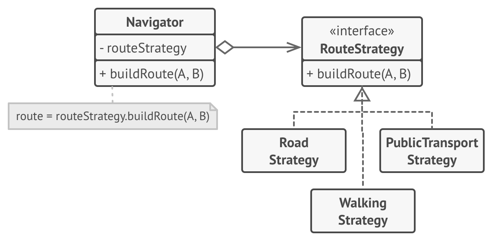

# Strategy

https://refactoring.guru/design-patterns/strategy 를 공부하며 정리한 내용입니다.

## Strategy란?

Strategy는 일련의 알고리즘을 정의하고 각 알고리즘을 별도의 클래스에 넣고 해당 개체를 교환할 수 있도록 하는 행동 디자인 패턴입니다.


## 문제

어느 날 당신은 캐주얼 여행자를 위한 내비게이션 앱을 만들기로 결정했습니다. 이 앱은 사용자가 어느 도시에서나 빠르게 방향을 잡을 수 있도록 도와주는 아름다운 지도를 중심으로 했습니다.

앱에서 가장 많이 요청된 기능 중 하나는 자동 경로 계획이었습니다. 사용자는 주소를 입력하고 지도에 표시된 해당 목적지로 가는 가장 빠른 경로를 볼 수 있어야 합니다.

앱의 첫 번째 버전은 도로 위의 경로만 만들 수 있었습니다. 차를 몰고 다니는 사람들은 기쁨에 벅차올랐습니다. 그러나 분명히 모든 사람이 휴가 중에 운전하는 것을 좋아하는 것은 아닙니다. 그래서 다음 업데이트에서는 도보 경로를 만드는 옵션을 추가했습니다. 그 직후 사람들이 경로에서 대중 교통을 사용할 수 있도록 다른 옵션을 추가했습니다.

그러나 그것은 시작에 불과했습니다. 나중에 자전거 타는 사람을 위한 경로 구축을 추가할 계획이었습니다. 그리고 나중에 도시의 모든 관광 명소를 통해 경로를 구축하는 또 다른 옵션입니다.


_<네비게이터의 코드가 부풀려졌습니다.>_

비즈니스 관점에서 앱은 성공했지만 기술적인 부분은 많은 골치거리를 야기했습니다. 새 라우팅 알고리즘을 추가할 때마다 내비게이터의 기본 클래스 크기가 두 배로 늘어납니다. 어느 시점에서 짐승은 유지하기가 너무 어려워졌습니다.

간단한 버그 수정이든 거리 점수의 약간의 조정이든 알고리즘 중 하나를 변경하면 전체 클래스에 영향을 미치므로 이미 작동하는 코드에서 오류가 발생할 가능성이 높아집니다.

또한 팀워크가 비효율적이었습니다. 성공적인 릴리스 직후에 고용된 팀원들은 병합 충돌을 해결하는 데 너무 많은 시간을 할애한다고 불평합니다. 새로운 기능을 구현하려면 다른 사람들이 생성한 코드와 충돌하는 동일한 거대한 클래스를 변경해야 합니다.

## 해결책

Strategy 패턴은 다양한 방식으로 특정 작업을 수행하는 클래스를 선택하고 이러한 모든 알고리즘을 Strategy라는 별도의 클래스로 추출할 것을 제안합니다.

컨텍스트라고 하는 원래 클래스에는 전략 중 하나에 대한 참조를 저장하기 위한 필드가 있어야 합니다. 컨텍스트는 자체적으로 실행하는 대신 연결된 전략 개체에 작업을 위임합니다.

컨텍스트는 작업에 적합한 알고리즘을 선택할 책임이 없습니다. 대신 클라이언트는 원하는 전략을 컨텍스트에 전달합니다. 사실, 컨텍스트는 전략에 대해 많이 알지 못합니다. 선택한 전략 내에 캡슐화된 알고리즘을 트리거하기 위한 단일 방법만 노출하는 동일한 일반 인터페이스를 통해 모든 전략과 함께 작동합니다.

이러한 방식으로 컨텍스트는 구체적인 전략과 무관하므로 컨텍스트 또는 기타 전략의 코드를 변경하지 않고도 새 알고리즘을 추가하거나 기존 알고리즘을 수정할 수 있습니다.



_<경로 계획 전략.>_

탐색 앱에서 각 라우팅 알고리즘은 단일 buildRoute 메서드를 사용하여 자체 클래스로 추출할 수 있습니다. 이 메서드는 출발지와 목적지를 수락하고 경로의 체크포인트 컬렉션을 반환합니다.

동일한 인수가 주어졌더라도 각 라우팅 클래스는 다른 경로를 구축할 수 있지만 기본 내비게이터 클래스는 기본 작업이 지도에 체크포인트 세트를 렌더링하는 것이기 때문에 어떤 알고리즘이 선택되는지에 대해서는 크게 신경 쓰지 않습니다. 클래스에는 활성 라우팅 전략을 전환하는 메서드가 있으므로 사용자 인터페이스의 버튼과 같은 클라이언트가 현재 선택한 라우팅 동작을 다른 것으로 바꿀 수 있습니다.

## 현실 유사성


_<공항에 도착하기 위한 다양한 전략.>_

공항에 가야한다고 상상해보십시오. 버스를 타거나 택시를 타거나 자전거를 탈 수 있습니다. 다음은 운송 전략입니다. 예산이나 시간 제약과 같은 요인에 따라 전략 중 하나를 선택할 수 있습니다.

## 구조


1. Context: Concrete Strategy 중 하나에 대한 참조를 유지하고 전략 인터페이스를 통해서만 이 객체와 통신합니다.
2. Strategy 인터페이스: 모든 Concrete Strategy에 공통입니다. Context가 전략을 실행하는 데 사용하는 방법을 선언합니다.
3. Concrete Strategy: Context가 사용하는 알고리즘의 다양한 변형을 구현합니다.
4. Context는 알고리즘을 실행해야 할 때마다 연결된 전략 개체의 실행 메서드를 호출합니다. Context는 어떤 유형의 전략으로 작동하는지 또는 알고리즘이 어떻게 실행되는지 모릅니다.
5. Client: 특정 전략 개체를 생성하여 Context에 전달합니다. Context는 클라이언트가 런타임에 Context와 관련된 전략을 대체할 수 있도록 하는 setter를 노출합니다.

## 의사 코드

이 예에서 Context는 다양한 산술 연산을 실행하기 위해 여러 전략을 사용합니다.

```java
// Strategy 인터페이스는 일부 알고리즘의 지원되는 모든 버전에 공통적인 작업을 선언합니다. Context는 이 인터페이스를 사용하여 Concrete Strategy에 의해 정의된 알고리즘을 호출합니다.
interface Strategy is
    method execute(a, b)

// Concrete Strategy는 기본 Strategy 인터페이스를 따르면서 알고리즘을 구현합니다. 인터페이스는 Context에서 상호 교환 가능하게 만듭니다.
class ConcreteStrategyAdd implements Strategy is
    method execute(a, b) is
        return a + b

class ConcreteStrategySubtract implements Strategy is
    method execute(a, b) is
        return a - b

class ConcreteStrategyMultiply implements Strategy is
    method execute(a, b) is
        return a * b

// Context는 클라이언트의 관심 인터페이스를 정의합니다.
class Context is
    // Context는 전략 개체 중 하나에 대한 참조를 유지합니다. Context는 전략의 구체적인 클래스를 알지 못합니다. 전략 인터페이스를 통해 모든 전략과 함께 작동해야 합니다.
    private strategy: Strategy

    // 일반적으로 Context는 생성자를 통해 전략을 수락하고 런타임에 전략을 전환할 수 있도록 setter도 제공합니다.
    method setStrategy(Strategy strategy) is
        this.strategy = strategy

    // Context는 자체적으로 여러 버전의 알고리즘을 구현하는 대신 일부 작업을 전략 개체에 위임합니다.
    method executeStrategy(int a, int b) is
        return strategy.execute(a, b)


// 클라이언트 코드는 Concrete Strategy을 선택하여 Context에 전달합니다. 클라이언트는 올바른 선택을 하기 위해 전략 간의 차이점을 알고 있어야 합니다.
class ExampleApplication is
    method main() is
        Create context object.

        Read first number.
        Read last number.
        Read the desired action from user input.

        if (action == addition) then
            context.setStrategy(new ConcreteStrategyAdd())

        if (action == subtraction) then
            context.setStrategy(new ConcreteStrategySubtract())

        if (action == multiplication) then
            context.setStrategy(new ConcreteStrategyMultiply())

        result = context.executeStrategy(First number, Second number)

        Print result.
```

## 적용 가능성

**객체 내에서 다양한 알고리즘 변형을 사용하고 런타임 중에 한 알고리즘에서 다른 알고리즘으로 전환할 수 있도록 하려는 경우 Strategy 패턴을 사용합니다.**

Strategy 패턴을 사용하면 다른 방식으로 특정 하위 작업을 수행할 수 있는 다른 하위 개체와 연결하여 런타임에 개체의 동작을 간접적으로 변경할 수 있습니다.

**일부 동작을 실행하는 방식만 다른 유사한 클래스가 많이 있는 경우 Strategy 사용합니다.**

Strategy 패턴을 사용하면 다양한 동작을 별도의 클래스 계층으로 추출하고 원래 클래스를 하나로 결합하여 중복 코드를 줄일 수 있습니다.

**패턴을 사용하여 해당 로직의 컨텍스트에서 중요하지 않을 수 있는 알고리즘의 구현 세부사항에서 클래스의 비즈니스 로직을 분리하십시오.**

Strategy 패턴을 사용하면 코드의 나머지 부분에서 코드, 내부 데이터 및 다양한 알고리즘의 종속성을 격리할 수 있습니다. 다양한 클라이언트는 알고리즘을 실행하고 런타임에 전환하기 위한 간단한 인터페이스를 얻습니다.

**클래스에 동일한 알고리즘의 다른 변형 간에 전환하는 대규모 조건문이 있는 경우 패턴을 사용합니다.**

Strategy 패턴을 사용하면 모든 알고리즘을 동일한 인터페이스를 구현하는 별도의 클래스로 추출하여 이러한 조건부를 제거할 수 있습니다. 원래 개체는 알고리즘의 모든 변형을 구현하는 대신 이러한 개체 중 하나에 실행을 위임합니다.

## 구현방법

1. Context 클래스에서 자주 변경되기 쉬운 알고리즘을 식별합니다. 런타임에 동일한 알고리즘의 변형을 선택하고 실행하는 대규모 조건일 수도 있습니다.
2. 알고리즘의 모든 변형에 공통적인 Strategy 인터페이스를 선언합니다.
3. 하나씩 모든 알고리즘을 자체 클래스로 추출합니다. 그들은 모두 Strategy 인터페이스를 구현해야 합니다.
4. Context 클래스에서 Strategy 개체에 대한 참조를 저장하기 위한 필드를 추가합니다. 해당 필드의 값을 대체하기 위한 setter를 제공하십시오. Context는 전략 인터페이스를 통해서만 전략 개체와 함께 작동해야 합니다. Context는 전략이 데이터에 액세스할 수 있도록 하는 인터페이스를 정의할 수 있습니다.
5. Context의 클라이언트는 Context가 기본 작업을 수행할 것으로 기대하는 방식과 일치하는 적절한 전략과 Context를 연관시켜야 합니다.

## 장단점

### 장점

- 런타임에 개체 내부에서 사용되는 알고리즘을 교환할 수 있습니다.
- 알고리즘을 사용하는 코드에서 알고리즘의 구현 세부 정보를 분리할 수 있습니다.
- 상속을 구성으로 대체할 수 있습니다.
- 개방/폐쇄 원칙. 컨텍스트를 변경하지 않고도 새로운 전략을 도입할 수 있습니다.

### 단점

- 알고리즘이 몇 개만 있고 거의 변경되지 않는다면 패턴과 함께 제공되는 새로운 클래스와 인터페이스로 프로그램을 지나치게 복잡하게 만들 이유가 없습니다.
- 클라이언트는 적절한 전략을 선택할 수 있도록 전략 간의 차이점을 알고 있어야 합니다.
- 많은 현대 프로그래밍 언어에는 익명 함수 집합 내에서 다양한 버전의 알고리즘을 구현할 수 있는 함수형 지원이 있습니다. 그러면 전략 객체를 사용했을 때와 똑같이 이 함수를 사용할 수 있지만 추가 클래스와 인터페이스로 코드를 부풀리지 않고 사용할 수 있습니다.

### 자바스크립트 예제

```javascript
var TrafficLight = function () {
  var count = 0;
  var currentState = new Red(this);

  this.change = function (state) {
    // limits number of changes
    if (count++ >= 10) return;
    currentState = state;
    currentState.go();
  };

  this.start = function () {
    currentState.go();
  };
};

var Red = function (light) {
  this.light = light;

  this.go = function () {
    console.log("Red --> for 1 minute");
    light.change(new Green(light));
  };
};

var Yellow = function (light) {
  this.light = light;

  this.go = function () {
    console.log("Yellow --> for 10 seconds");
    light.change(new Red(light));
  };
};

var Green = function (light) {
  this.light = light;

  this.go = function () {
    console.log("Green --> for 1 minute");
    light.change(new Yellow(light));
  };
};

function run() {
  var light = new TrafficLight();
  light.start();
}
```
