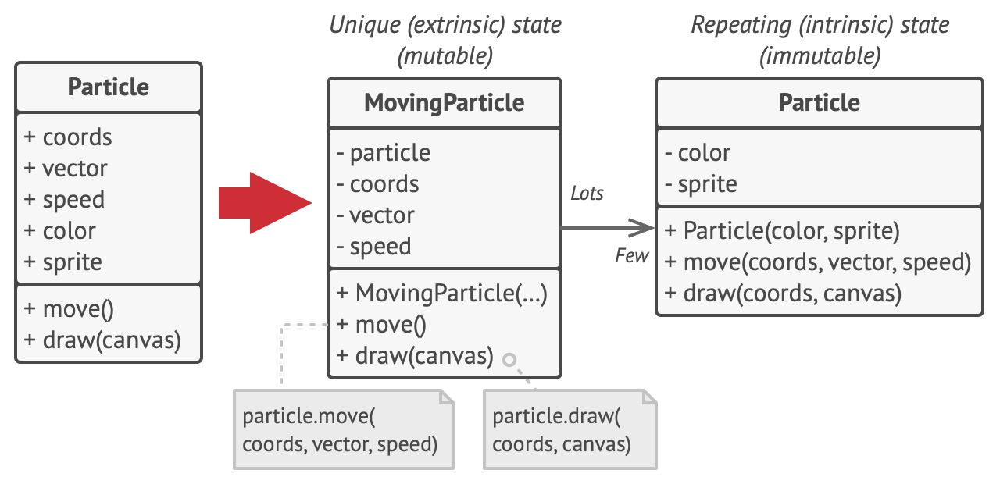
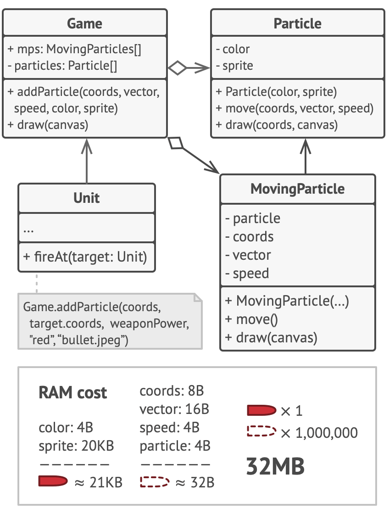
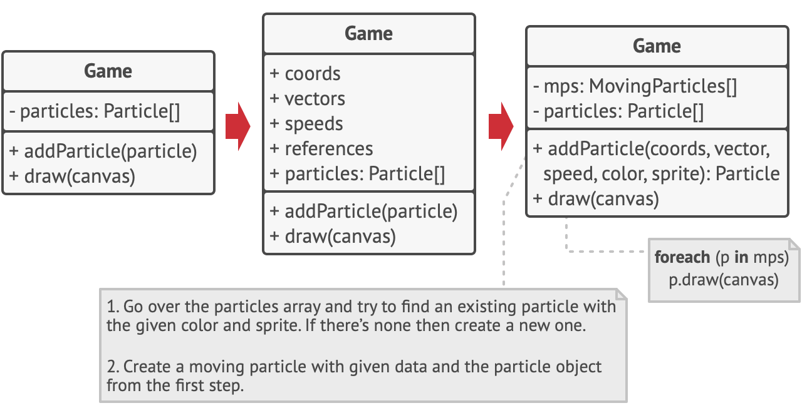

# Flyweight

https://refactoring.guru/design-patterns/flyweight 를 공부하며 정리한 내용입니다.

## Flyweight란?

Flyweight는 각 개체의 모든 데이터를 유지하는 대신 여러 개체 간에 공통 상태 부분을 공유하여 사용 가능한 RAM 양에 더 많은 개체를 맞출 수 있는 구조적 디자인 패턴입니다.


## 문제

긴 근무 시간 후 재미를 느끼기 위해 간단한 비디오 게임을 만들기로 결정했습니다. 플레이어는 지도를 돌아다니며 서로 총을 쏘게 됩니다. 사실적인 입자 시스템을 구현하고 이를 게임의 독특한 기능으로 만들기로 결정했습니다. 폭발로 인한 방대한 양의 총알, 미사일 및 파편이 맵 전체를 날아다니며 플레이어에게 스릴 넘치는 경험을 선사해야 합니다.

완료되면 마지막 커밋을 푸시하고 게임을 빌드하고 테스트 드라이브를 위해 친구에게 보냈습니다. 게임이 당신의 컴퓨터에서 완벽하게 실행되고 있었지만 당신의 친구는 오랫동안 게임을 할 수 없었습니다. 그의 컴퓨터에서 게임은 몇 분의 게임 플레이 후에도 계속 충돌했습니다. 디버그 로그를 파헤치는 데 몇 시간을 보낸 후 RAM이 충분하지 않아 게임이 충돌했음을 발견했습니다. 친구의 장비가 당신의 컴퓨터보다 훨씬 덜 강력하다는 것이 밝혀졌고, 그래서 그의 컴퓨터에서 문제가 너무 빨리 나타났습니다.

실제 문제는 입자 시스템과 관련되었습니다. 총알, 미사일 또는 파편 조각과 같은 각 입자는 많은 데이터가 포함된 별도의 개체로 표시되었습니다. 어느 시점에서 플레이어 화면의 대학살이 절정에 이르렀을 때 새로 생성된 입자가 더 이상 나머지 RAM에 맞지 않아 프로그램이 충돌했습니다.


## 해결책

Particle 클래스를 자세히 살펴보면 색상 및 스프라이트 필드가 다른 필드보다 훨씬 더 많은 메모리를 사용한다는 것을 알 수 있습니다. 더 나쁜 것은 이 두 필드가 모든 입자에 걸쳐 거의 동일한 데이터를 저장한다는 것입니다. 예를 들어, 모든 총알은 동일한 색상과 스프라이트를 갖습니다.



좌표, 이동 벡터 및 속도와 같은 입자 상태의 다른 부분은 각 입자에 고유합니다. 결국 이러한 필드의 값은 시간이 지남에 따라 변경됩니다. 이 데이터는 입자가 존재하는 항상 변화하는 컨텍스트를 나타내는 반면 색상과 스프라이트는 각 입자에 대해 일정하게 유지됩니다.

객체의 이 상수 데이터를 일반적으로 고유 상태라고 합니다. 그것은 물체 안에 산다. 다른 개체는 읽을 수만 있고 변경할 수는 없습니다. 종종 다른 객체에 의해 "외부에서" 변경되는 나머지 객체 상태를 외부 상태라고 합니다.

Flyweight 패턴은 객체 내부에 외부 상태 저장을 중단할 것을 제안합니다. 대신 이 상태를 의존하는 특정 메서드에 이 상태를 전달해야 합니다. 고유 상태만 개체 내에 유지되므로 다른 컨텍스트에서 재사용할 수 있습니다. 결과적으로 이러한 객체는 외부보다 변형이 훨씬 적은 고유 상태에서만 다르기 때문에 더 적은 수의 객체가 필요합니다.



우리 게임으로 돌아가자. 입자 클래스에서 외부 상태를 추출했다고 가정하면 총알, 미사일, 파편의 세 가지 다른 개체만 게임의 모든 입자를 나타내기에 충분합니다. 지금쯤 짐작하셨겠지만 고유 상태만 저장하는 객체를 Flyweight라고 합니다.

### 외부 상태 스토리지

외적 상태는 어디로 이동하는가? 일부 클래스는 여전히 저장해야 합니다. 맞죠? 대부분의 경우 패턴을 적용하기 전에 개체를 집계하는 컨테이너 개체로 이동합니다.

우리의 경우, 그것은 파티클 필드에 모든 파티클을 저장하는 메인 게임 객체입니다. 외부 상태를 이 클래스로 이동하려면 각 개별 입자의 좌표, 벡터 및 속도를 저장하기 위한 여러 배열 필드를 생성해야 합니다. 하지만 그게 다가 아닙니다. 입자를 나타내는 특정 Flyweight에 대한 참조를 저장하려면 다른 배열이 필요합니다. 이러한 배열은 동일한 인덱스를 사용하여 입자의 모든 데이터에 액세스할 수 있도록 동기화되어야 합니다.



보다 우아한 솔루션은 Flyweight 개체에 대한 참조와 함께 외부 상태를 저장할 별도의 컨텍스트 클래스를 만드는 것입니다. 이 접근 방식을 사용하려면 컨테이너 클래스에 단일 배열만 있어야 합니다.

잠깐만! 초기에 가졌던 것처럼 이러한 컨텍스트 객체를 많이 가질 필요가 없습니까? 기술적으로 그렇습니다. 그러나 문제는 이러한 개체가 이전보다 훨씬 작다는 것입니다. 가장 메모리를 많이 사용하는 필드가 몇 개의 Flyweight 개체로 이동되었습니다. 이제 천 개의 작은 컨텍스트 개체가 데이터의 천 개의 복사본을 저장하는 대신 단일 중량 Flyweight 개체를 재사용할 수 있습니다.

### Flyweight와 불변성

동일한 Flyweight 객체가 다른 컨텍스트에서 사용될 수 있으므로 해당 상태를 수정할 수 없는지 확인해야 합니다. Flyweight는 생성자 매개변수를 통해 상태를 한 번만 초기화해야 합니다. setter나 public 필드를 다른 객체에 노출해서는 안 됩니다.

### Flyweight Factory

다양한 Flyweight에 보다 편리하게 액세스하기 위해 기존 Flyweight 개체 풀을 관리하는 Factory Method를 생성할 수 있습니다. 이 메서드는 클라이언트에서 원하는 Flyweight의 고유 상태를 받아들이고 이 상태와 일치하는 기존 Flyweight 개체를 찾고 발견되면 반환합니다. 그렇지 않은 경우 새 Flyweight를 생성하여 풀에 추가합니다.

이 방법을 배치할 수 있는 몇 가지 옵션이 있습니다. 가장 눈에 띄는 장소는 Flyweight 컨테이너입니다. 또는 새 Factory 클래스를 생성할 수 있습니다. 또는 Factory Method를 정적으로 만들고 실제 Flyweight 클래스 안에 넣을 수 있습니다.

## 구조


1. Flyweight 패턴은 단지 최적화일 뿐입니다. 적용하기 전에 프로그램이 동시에 메모리에 유사한 개체를 대량으로 보유하는 것과 관련된 RAM 소비 문제가 있는지 확인하십시오. 이 문제가 다른 의미 있는 방법으로 해결되지 않도록 하십시오.
2. Flyweight 클래스: 여러 개체 간에 공유할 수 있는 원래 개체의 상태 부분이 포함되어 있습니다. 동일한 Flyweight 객체가 다양한 상황에서 사용될 수 있습니다. Flyweight 내부에 저장된 상태를 고유(intrinsic)이라고 합니다. Flyweight의 메소드에 전달된 상태를 외부라고 합니다.
3. Context 클래스: 모든 원본 객체에서 고유한 외부 상태를 포함합니다. 컨텍스트가 Flyweight 개체 중 하나와 쌍을 이루는 경우 원래 개체의 전체 상태를 나타냅니다.
4. 일반적으로 원래 개체의 동작은 Flyweight 클래스에 남아 있습니다. 이 경우 Flyweight의 메소드를 호출하는 사람은 외부 상태의 적절한 비트도 메소드의 매개변수에 전달해야 합니다. 다른 한편으로, 동작은 연결된 Flyweight를 데이터 객체로만 사용하는 Context 클래스로 이동할 수 있습니다.
5. Client: Flyweight의 외부 상태를 계산하거나 저장합니다. 클라이언트의 관점에서 Flyweight는 일부 컨텍스트 데이터를 메서드의 매개변수에 전달하여 런타임에 구성할 수 있는 템플릿 개체입니다.
6. Flyweight Factory: 기존 Flyweight 풀을 관리합니다. Factory에서 Client는 Flyweight를 직접 만들지 않습니다. 대신에 원하는 Flyweight의 고유 상태 비트를 전달하여 Factory를 호출합니다. Factory는 이전에 생성된 Flyweight를 살펴보고 검색 기준과 일치하는 기존 Flyweight를 반환하거나 아무것도 발견되지 않으면 새 Flyweight를 생성합니다.

## 의사 코드

이 예에서 Flyweight 패턴은 캔버스에 수백만 개의 나무 개체를 렌더링할 때 메모리 사용량을 줄이는 데 도움이 됩니다.


패턴은 기본 Tree 클래스에서 반복되는 고유 상태를 추출하고 이를 Flyweight 클래스 TreeType으로 이동합니다.

이제 동일한 데이터를 여러 개체에 저장하는 대신 몇 개의 Flyweight 개체에 보관하고 컨텍스트 역할을 하는 적절한 Tree 개체에 연결합니다. 클라이언트 코드는 올바른 개체를 검색하고 필요한 경우 재사용하는 복잡성을 캡슐화하는 Flyweight Factory를 사용하여 새 Tree 개체를 생성합니다.

```java
// Flyweight 클래스는 Tree 상태의 일부를 포함합니다. 이러한 필드는 각 특정 Tree에 대해 고유한 값을 저장합니다. 예를 들어 여기에서는 나무 좌표를 찾을 수 없습니다. 그러나 여기에는 많은 나무가 공유하는 질감과 색상이 있습니다. 이 데이터는 일반적으로 크기 때문에 각 Tree 개체에 보관하면 많은 메모리를 낭비하게 됩니다. 대신 텍스처, 색상 및 기타 반복 데이터를 많은 개별 Tree 개체가 참조할 수 있는 별도의 개체로 추출할 수 있습니다.
class TreeType is
    field name
    field color
    field texture
    constructor TreeType(name, color, texture) { ... }
    method draw(canvas, x, y) is
        // 1. 주어진 유형, 색상 및 질감의 비트맵을 만듭니다.
        // 2. 캔버스의 X 및 Y 좌표에 비트맵을 그립니다.

// Flyweight Factory는 기존 Flyweight를 재사용할지 아니면 새로운 객체를 생성할지 결정합니다.
class TreeFactory is
    static field treeTypes: collection of tree types
    static method getTreeType(name, color, texture) is
        type = treeTypes.find(name, color, texture)
        if (type == null)
            type = new TreeType(name, color, texture)
            treeTypes.add(type)
        return type

// Context 개체는 Tree 상태의 외부 부분을 포함합니다. 애플리케이션은 두 개의 정수 좌표와 하나의 참조 필드로 매우 작기 때문에 수십억 개를 생성할 수 있습니다.
class Tree is
    field x,y
    field type: TreeType
    constructor Tree(x, y, type) { ... }
    method draw(canvas) is
        type.draw(canvas, this.x, this.y)

// Tree 및 Forest 클래스는 플라이급의 클라이언트입니다. Tree 클래스를 더 이상 개발할 계획이 없으면 병합할 수 있습니다.
class Forest is
    field trees: collection of Trees

    method plantTree(x, y, name, color, texture) is
        type = TreeFactory.getTreeType(name, color, texture)
        tree = new Tree(x, y, type)
        trees.add(tree)

    method draw(canvas) is
        foreach (tree in trees) do
            tree.draw(canvas)

```

## 적용 가능성

**프로그램이 사용 가능한 RAM에 거의 맞지 않는 엄청난 수의 객체를 지원해야 하는 경우에만 Flyweight 패턴을 사용하십시오.**

패턴 적용의 이점은 패턴을 사용하는 방법과 위치에 따라 크게 달라집니다. 다음과 같은 경우에 가장 유용합니다.

- 응용 프로그램은 수많은 유사한 개체를 생성해야 합니다.
- 이것은 대상 장치에서 사용 가능한 모든 RAM을 소모합니다.
- 객체에는 여러 객체 간에 추출 및 공유할 수 있는 중복 상태가 포함되어 있습니다.

## 구현방법

1. Flyweight가 될 클래스의 필드를 두 부분으로 나눕니다.
   - 고유 상태: 많은 개체에 걸쳐 복제된 변경되지 않는 데이터를 포함하는 필드
   - 외부 상태: 각 개체에 고유한 컨텍스트 데이터를 포함하는 필드
2. 클래스의 고유 상태를 나타내는 필드를 그대로 두되, 변경할 수 없는지 확인하십시오. 생성자 내에서만 초기 값을 가져와야 합니다.
3. 외부 상태의 필드를 사용하는 방법을 살펴보십시오. 메소드에 사용된 각 필드에 대해 새 매개변수를 도입하고 필드 대신 사용하십시오.
4. 선택적으로 Flyweight 풀을 관리하기 위한 Factory 클래스를 생성합니다. 새 Flyweight를 만들기 전에 기존 Flyweight를 확인해야 합니다. Factory가 설치되면 고객은 Factory를 통해서만 Flyweight를 요청해야 합니다. 그들은 Factory에 고유 상태를 전달하여 원하는 Flyweight를 설명해야 합니다.
5. 클라이언트는 Flyweight 개체의 메서드를 호출할 수 있도록 외부 상태(컨텍스트) 값을 저장하거나 계산해야 합니다. 편의상, Flyweight 참조 필드와 함께 외부 상태는 별도의 컨텍스트 클래스로 이동할 수 있다.

## 장단점

### 장점

- 프로그램에 유사한 개체가 많이 있다고 가정하면 많은 RAM을 절약할 수 있습니다.

### 단점

- 누군가가 Flyweight 메서드를 호출할 때마다 컨텍스트 데이터 중 일부를 다시 계산해야 하는 경우 CPU 주기보다 RAM을 거래할 수 있습니다.
- 코드가 훨씬 더 복잡해집니다. 새로운 팀원들은 항상 엔티티의 상태가 왜 그런 식으로 분리되었는지 궁금해 할 것입니다.

### 자바스크립트 예제

```javascript
function Flyweight(make, model, processor) {
  this.make = make;
  this.model = model;
  this.processor = processor;
}

var FlyWeightFactory = (function () {
  var flyweights = {};

  return {
    get: function (make, model, processor) {
      if (!flyweights[make + model]) {
        flyweights[make + model] = new Flyweight(make, model, processor);
      }
      return flyweights[make + model];
    },

    getCount: function () {
      var count = 0;
      for (var f in flyweights) count++;
      return count;
    },
  };
})();

function ComputerCollection() {
  var computers = {};
  var count = 0;

  return {
    add: function (make, model, processor, memory, tag) {
      computers[tag] = new Computer(make, model, processor, memory, tag);
      count++;
    },

    get: function (tag) {
      return computers[tag];
    },

    getCount: function () {
      return count;
    },
  };
}

var Computer = function (make, model, processor, memory, tag) {
  this.flyweight = FlyWeightFactory.get(make, model, processor);
  this.memory = memory;
  this.tag = tag;
  this.getMake = function () {
    return this.flyweight.make;
  };
  // ...
};

function run() {
  var computers = new ComputerCollection();

  computers.add("Dell", "Studio XPS", "Intel", "5G", "Y755P");
  computers.add("Dell", "Studio XPS", "Intel", "6G", "X997T");
  computers.add("Dell", "Studio XPS", "Intel", "2G", "U8U80");
  computers.add("Dell", "Studio XPS", "Intel", "2G", "NT777");
  computers.add("Dell", "Studio XPS", "Intel", "2G", "0J88A");
  computers.add("HP", "Envy", "Intel", "4G", "CNU883701");
  computers.add("HP", "Envy", "Intel", "2G", "TXU003283");

  console.log("Computers: " + computers.getCount());
  console.log("Flyweights: " + FlyWeightFactory.getCount());
}
```
